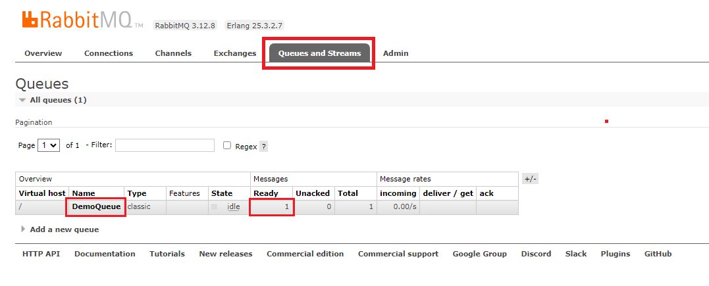

# Run RabbitMQ locally with Docker

Run the command below.

```
docker run -d --hostname rmq --name rabbit-server -p 8080:15672 -p 5672:5672 rabbitmq:3-management
```

Open http://localhost:8080/ locally in your browser. Default login is `guest` and default password is `guest`.

I expect you to see the following picture.


